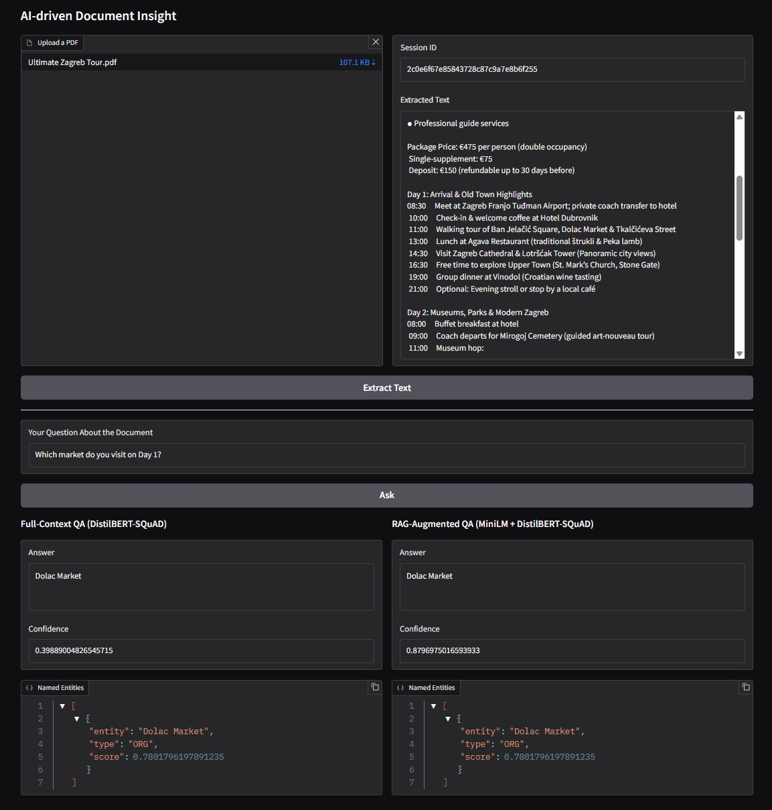

# Document Insight Service

An AI-powered platform for extracting insights from PDF documents. Upload a PDF, view the extracted text, and ask questions about its content. For each question, you get answers from both a classic QA model (DistilBERT SQuAD) and an enhanced retrieval augmented approach (MiniLM embeddings with FAISS and QA). This lets you compare the results side by side. The system uses a FastAPI backend, a Gradio frontend, and Redis for fast session and embedding storage. Use example_docs from root to test the app.


## Features
- **Intuitive Gradio Web UI** for uploading PDFs, previewing extracted text, and posing questions  
- **1-Hour Session Persistence**: Uploaded documents are cached in Redis for up to one hour via JWT-secured sessions  
- **Dual QA Modes**:  
  - **Full-Context QA** with DistilBERT-SQuAD over the entire document  
  - **RAG-Augmented QA** using MiniLM embeddings + FAISS retrieval + DistilBERT for focused answers  
- **Answer Enrichment** with Named-Entity Extraction  
- **JWT-Based Security** to protect access to stored document content  
- **Docker & Docker Compose** for zero-friction local development and deployment  


## Setup Instructions

### Requirements
- Docker

Use Docker Compose for running the app:
   ```sh
   docker compose up --build
   ```

## Example API Requests

### 1. Upload a PDF
```http
POST /upload
Content-Type: multipart/form-data

file: <yourfile.pdf>
```
**Response:**
```json
{
  "session_id": "b1c2d3e4...",
  "page_texts": ["Page 1 text", "Page 2 text", ...]
}
```

### 2. Ask a Question
```http
POST /ask
Authorization: Bearer <session_token>
Content-Type: application/x-www-form-urlencoded

question=What is the main topic?
```
**Response:**
```json
{
  "results": [
    {
      "model_name": "Full-Context QA (DistilBERT-SQuAD)",
      "description": "...",
      "answer": "...",
      "score": 0.98,
      "entities": [
        {"entity": "AI", "type": "Topic", "score": 0.99}
      ]
    },
    {
      "model_name": "RAG-Augmented QA (MiniLM + DistilBERT-SQuAD)",
      "description": "...",
      "answer": "...",
      "score": 0.95,
      "entities": []
    }
  ]
}
```

---

## Approach & Tools

- **FastAPI**: Modern, fast web framework for building APIs.
- **PyMuPDF**: For extracting text from PDF files.
- **Redis**: Used for fast session and embedding storage.
- **SentenceTransformers (MiniLM)**: Encodes text (chunks and questions) into dense vector embeddings.
- **FAISS**: Builds an index over those vectors to perform fast nearest-neighbor (similarity) searches in the RAG pipeline.
- **DistilBERT (SQuAD)**: For extractive QA over text chunks or full document.

---

## 📸 Screenshots & Demo


> 
> _Example: Uploading a PDF and asking a question._

